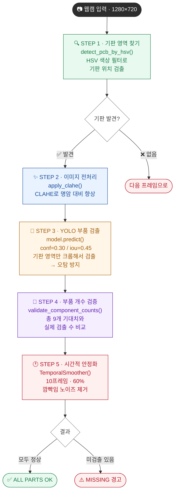

# 📜 Scripts
실행 스크립트 폴더

## ⚠️ 실행 전 유의 사항
실행을 위한 패키지 설치 필수!
```bash
pip install -r requirements.txt
```

## ⚙️ PCB 결함 검출 파이프라인


```mermaid
flowchart TD
    A([📷 웹캠 입력 · 1280×720])
    A --> B["🔍 STEP 1 · 기판 영역 찾기<br/>detect_pcb_by_hsv()<br/>HSV 색상 필터로
기판 위치 검출"]
    B --> C{기판 발견?}
    C -- "✅ 발견" --> D
    C -- "❌ 없음" --> E([다음 프레임으로])
    D["✨ STEP 2 · 이미지 전처리<br/>apply_clahe()<br/>CLAHE로 명암 대비 향상"]
    D --> F["🤖 STEP 3 · YOLO 부품 검출<br/>model.predict()
 conf=0.30 / iou=0.45<br/>기판 영역만 크롭해서 검출 → 오탐 방지"]
    F --> G["🔢 STEP 4 · 부품 개수 검증<br/>validate_component_counts()<br/>총 9개 기대치와
실제 검출 수 비교"]
    G --> H["🕐 STEP 5 · 시간적 안정화<br/>TemporalSmoother()
 10프레임 · 60%<br/>깜빡임 노이즈 제거"]
    H --> I{결과}
    I -- "모두 정상" --> J([✅ ALL PARTS OK])
    I -- "미검출 있음" --> K([⚠️ MISSING 경고])
    style A fill:#2d2d2d,color:#fff,stroke:#2d2d2d
    style B fill:#e8faf0,stroke:#1a7a45,color:#1a7a45
    style C fill:#fff,stroke:#888,color:#444
    style D fill:#e8f3ff,stroke:#1a4a9a,color:#1a4a9a
    style E fill:#fff0f0,stroke:#b01020,color:#b01020
    style F fill:#fff6e8,stroke:#a05a00,color:#a05a00
    style G fill:#f5eeff,stroke:#6020b0,color:#6020b0
    style H fill:#fff0f0,stroke:#b01020,color:#b01020
    style I fill:#fff,stroke:#888,color:#444
    style J fill:#e8faf0,stroke:#1a7a45,color:#1a7a45
    style K fill:#fff0f0,stroke:#b01020,color:#b01020
```

## 참고
- 모델 학습 및 예측 과정은 `notebook/` 폴더의 Colab 노트북 파일 참고
